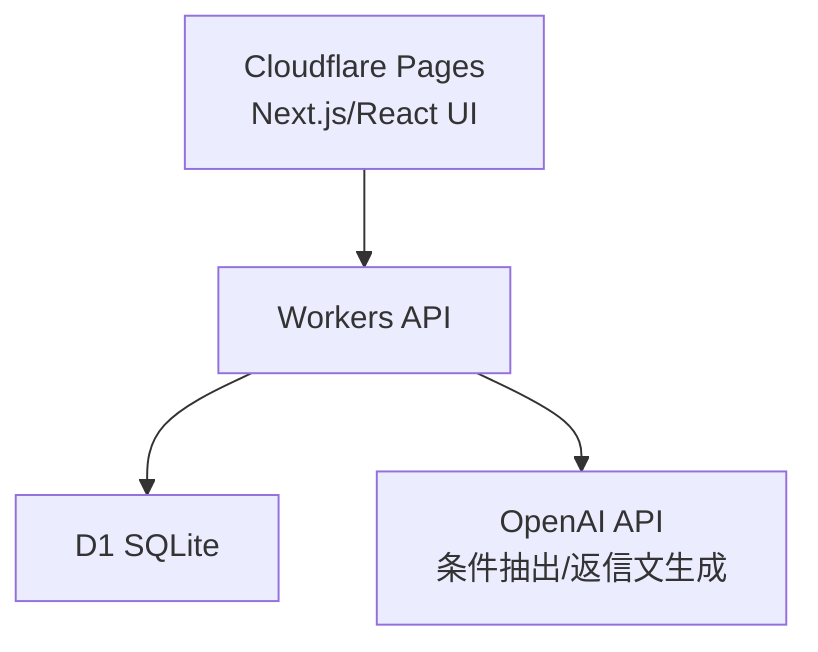
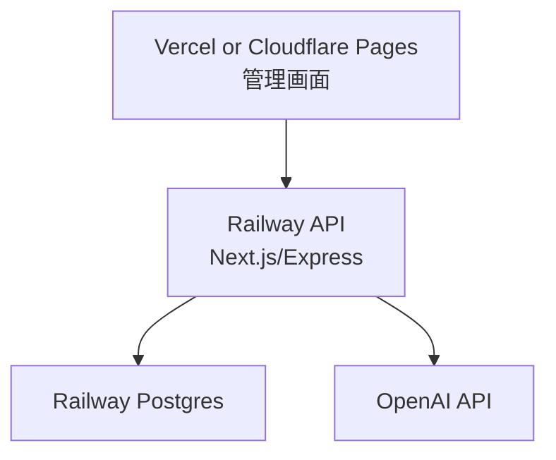
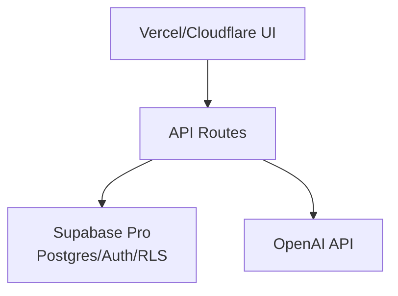
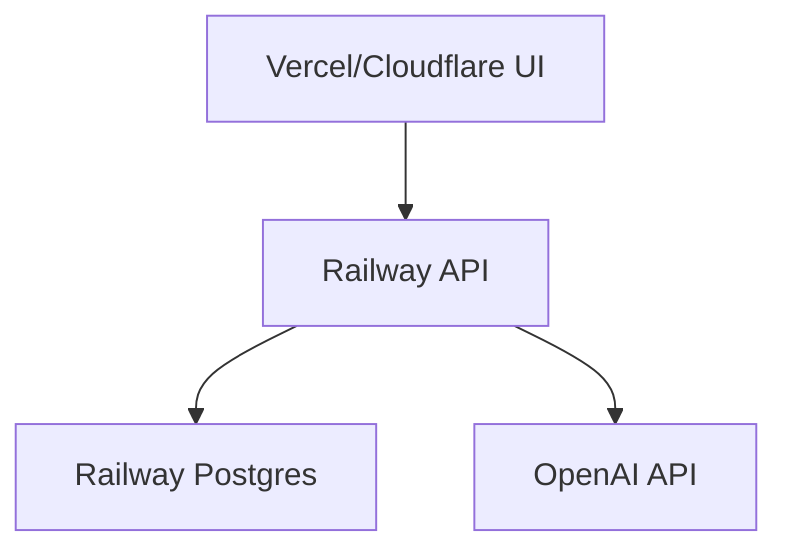

# MVP A: 公開・クラウド構成方針

作成日: 2026-06-30  
対象: 反響統合・マッチング・内見調整コパイロット  
前提: 既にVercelに複数アプリ、Supabase無料枠2件は使用済み、Railway Hobby $5で2アプリ運用、Cloudflare利用中、Fly.io従量制、Appwrite無料枠で1アプリ運用、Firestoreも利用経験あり。

---

## 1. 結論

MVP Aは、公開目的を3段階に分けてクラウドを選ぶ。

| 段階 | 目的 | 推奨構成 | 月額目安 | 理由 |
| --- | --- | --- | ---: | --- |
| Demo | 営業用デモ、サンプルデータのみ | Cloudflare Pages + Workers + D1 | 0円から | Supabase枠を使わず、静的/軽量API/SQLiteで足りる |
| Pilot | 特定の相手に実データで試す | Vercel or Cloudflare Pages + Railway Postgres/API | 既存Railway $5枠 + 超過分 | 個人情報・バックアップ・SQL集計を扱いやすい |
| SaaS | 複数事業者向けに売る | Supabase Pro or Railway Postgres + 専用バックエンド | $25以上 | Auth/RLS/運用監査/バックアップを本格化できる |

現時点の最優先案:

1. 営業デモは `Cloudflare Pages + Workers + D1` で作る。
2. 実名・電話番号を入れるパイロットは `Railway Postgres` または `Railway上のAPI + DB` に寄せる。
3. Supabaseは無料枠が埋まっているため、MVP Aでは新規採用しない。SaaS化の手応えが出たらPro検討。
4. Appwrite無料枠は既に1件運用中なので、新規MVP Aには使わない。
5. Firestoreは「小規模・単純CRUD・Google系でまとめたい」場合の代替。リレーショナルな物件マッチングやSQL集計には第一候補にしない。

---

## 2. 各サービスの現状整理

### 2.1 Vercel

公式価格では Hobbyは$0、Proは$20/月。HobbyでもCDN、CI/CD、WAF、Functions枠がある。Proでは$20分の利用クレジット、チーム、より速いビルドなどが入る。  
Source: [Vercel Pricing](https://vercel.com/pricing)

MVP Aでの使い方:

- Next.jsフロントの公開には向く。
- DBは別サービスが必要。
- サーバーレス関数で軽いAPIは可能。
- 長時間処理、メール監視、定期取込、重いAIバッチには向かない。

判断:

- 既に複数アプリを置いているなら、フロントだけなら継続利用でよい。
- ただしMVP Aの個人情報DBまでVercel内に閉じることはできない。
- デモ用ならVercel + Cloudflare D1 APIでもよいが、同一基盤に寄せるならCloudflare Pagesの方が構成が単純。

### 2.2 Supabase

公式価格では Freeは2 active projectsまで、500MB DB、50,000 MAU、5GB egress、1GB file storage。Free projectsは1週間非アクティブでpause。Proは$25/月からで、最初のプロジェクト相当のcompute creditを含むが、追加プロジェクトは追加費用が発生する。  
Source: [Supabase Pricing](https://supabase.com/pricing)

MVP Aでの使い方:

- Auth、Postgres、RLS、Storage、管理画面が強い。
- 個人情報を扱う業務SaaSにはかなり相性がよい。
- ただしユーザーの無料枠2件が既に埋まっている。

判断:

- 今回のMVP Aで新規Supabase Freeは使えない前提にする。
- すぐ課金するならPro $25/月が基準になるため、商談前のデモには重い。
- 有料顧客または法人化後の本命SaaSで採用するのがよい。

### 2.3 Railway

公式価格では Hobbyは$5 minimum usageで、$5分の月間利用クレジットを含む。超過分は実使用量課金。1サービス最大48 vCPU/48GB RAM、5GB storageなど。  
Source: [Railway Pricing](https://railway.com/pricing), [Railway Docs Pricing](https://docs.railway.com/pricing)

MVP Aでの使い方:

- Node/Next API、Postgres、軽いワーカーをまとめやすい。
- 既にHobby課金済みなので、追加の小型API/DBを置きやすい。
- 個人情報を扱う実運用パイロットにはCloudflare D1より扱いやすい。

判断:

- 実データを入れるならRailwayを第一候補にする。
- ただし2アプリ運用中なので、メモリ常時消費・DBストレージ・ログ量で$5を超えないか確認する。
- 追加サービスを作る場合は、アプリを小さくし、スリープ/低メモリ/ログ抑制を徹底する。

### 2.4 Cloudflare Pages / Workers / D1

Cloudflare D1はWorkers Freeでも利用可能。公式価格ではFreeでD1 rows read 5 million/day、rows written 100,000/day、storage 5GB total。Paidでは月次の大きな無料枠がある。D1は使用したクエリ行数とストレージで課金され、scale-to-zeroでアイドル課金がない。  
Source: [Cloudflare D1 Pricing](https://developers.cloudflare.com/d1/platform/pricing/), [Cloudflare Workers Pricing](https://developers.cloudflare.com/workers/platform/pricing/)

MVP Aでの使い方:

- 営業デモ、サンプルデータ、低頻度の管理画面に非常に向く。
- D1はSQLiteなので、15物件・月100反響程度なら十分。
- WorkersでAPI、Pagesでフロント、D1でDBが完結する。
- Supabase無料枠を消費しない。

弱点:

- SupabaseのようなAuth/RLSは標準ではない。
- Postgres拡張や複雑なSQL、全文検索、ジョブ管理は弱い。
- 個人情報を扱う場合は、アプリ側の認可設計、Cloudflare Access、監査ログが必要。
- テーブル全走査はrows read課金に響くため、インデックス設計が必要。

判断:

- 公開デモの第一候補。
- 実データ運用でも、1社専用・少量・Cloudflare Accessで保護するなら可能。
- 複数顧客SaaSの本命DBとしては、最初から決め打ちしない。

### 2.5 Fly.io

Fly.ioは従量課金で、Machines、Volumes、Snapshotsなどに課金される。公式docsではVolumesは$0.15/GB/月で、停止中や未接続でも作成済みボリュームは課金対象。Managed PostgresやUnmanaged Postgresも別途注意が必要。  
Source: [Fly.io Pricing](https://fly.io/docs/about/pricing/)

MVP Aでの使い方:

- Docker前提のアプリやSQLite永続化には向く。
- 小型の単体バックエンドを置ける。
- ただし課金の見落としが起きやすい。

判断:

- 今回の第一候補ではない。
- 「Railwayの月額が膨らむ」「Dockerで固めたい」「SQLiteファイルで運用したい」場合の代替。
- 使うなら不要なapp、volume、snapshotを消す運用ルールをmdに書く。

### 2.6 Appwrite

公式価格ではFreeは2 projects、API bandwidth 5GB/month、storage 2GB、1 database/project、reads 500K/month、writes 250K/month、functions 2/projectなど。Freeで上限に達するとprojectがfreezeする。Proは専用リソースで追加プロジェクト課金がある。  
Source: [Appwrite Pricing](https://appwrite.io/pricing)

MVP Aでの使い方:

- Auth、DB、Storage、Functionsをまとめて使える。
- ただし既に無料枠で1アプリ運用中。
- Freeの制約とfreezeリスクがある。

判断:

- 新規MVP Aには使わない。
- 既存Appwriteアプリと統合する理由がある場合だけ検討する。
- 本番個人情報管理に使うならPro前提で費用再計算。

### 2.7 Firebase / Firestore

公式docsではCloud Firestoreの無料枠は1 projectにつき1 free database。Stored data 1GiB、document reads 50,000/day、writes 20,000/day、deletes 20,000/day、outbound data transfer 10GiB/month。追加DBやTTL/PITR/Backup/Restore等は課金対象。  
Source: [Firestore Pricing](https://firebase.google.com/docs/firestore/pricing)

MVP Aでの使い方:

- 小規模CRUD、認証、リアルタイムUIには強い。
- 無料枠が比較的実用的。
- Googleアカウント/Firebase Authとの相性がよい。

弱点:

- 物件マッチング、集計、複雑な条件検索はPostgres/SQLより設計が難しい。
- ドキュメント読み取り回数が増えるUIだと課金/上限に触れやすい。
- SQL移行時にデータモデル変換が必要。

判断:

- 「最速でスマホ向け管理画面を作る」ならあり。
- ただしMVP Aは物件条件・リード・タスク・活動履歴の関係が多いので、第一候補はSQL系にする。

---

## 3. 推奨アーキテクチャ

### 3.1 Demo構成

営業相手に見せる公開デモ。実名・電話番号は入れない。



技術スタック:

- Frontend: Next.js or Vite React
- API: Cloudflare Workers / Pages Functions
- DB: Cloudflare D1
- Auth: デモ用の簡易ログイン、またはCloudflare Access
- AI: OpenAI API
- Storage: 画像やPDFを置くならR2。MVP Aでは原則不要

この構成で作る理由:

- 月額0円から始めやすい。
- Supabase枠を消費しない。
- 15物件、サンプル反響、AI返信文生成には十分。
- 公開URLを営業で見せやすい。

注意:

- 実顧客データは入れない。
- デモ用seed dataを使う。
- API keyはCloudflare Secretsに保存する。
- D1はindexを貼る。

### 3.2 Pilot構成

相手の実データを入れて1社専用で試す。



技術スタック:

- Frontend: Vercel or Cloudflare Pages
- Backend: Railway上のNode API
- DB: Railway Postgres
- Auth: Better Auth / Auth.js / 独自メールログイン
- AI: OpenAI API
- Backup: Railway DB backup/export運用を別途決める

この構成で作る理由:

- 個人情報をSQLで扱いやすい。
- 活動履歴、タスク、マッチング、集計がD1より安心。
- Railwayは既に課金済みで、心理的導入コストが低い。

注意:

- 既存Railway 2アプリの使用量を見てから追加する。
- DBを共有する場合はschemaまたはtable prefixを明確化する。
- 実データを使うなら、最低限のバックアップと削除ルールを決める。

### 3.3 SaaS構成

複数社に提供する段階。

候補A: Supabase Pro



候補B: Railway Postgres + 独自Auth



判断基準:

| 条件 | Supabase Pro | Railway Postgres |
| --- | --- | --- |
| Auth/RLSを早く作りたい | 強い | 自作が必要 |
| SQL自由度 | 強い | 強い |
| 月額固定感 | $25から | $5からだが超過あり |
| 複数小アプリ併用 | 追加費に注意 | リソース共有しやすい |
| 管理画面/DB確認 | とても強い | 普通 |
| 将来のSaaS化 | 強い | 可能だが設計責任が重い |

結論:

- 月額$25を顧客単価で吸収できるならSupabase Pro。
- まだ顧客単価が読めない間はRailwayで粘る。

---

## 4. MVP AのCodex向け実装方針

### 4.1 DB抽象化

将来D1からPostgresへ移行できるように、DBアクセスを画面に直書きしない。

推奨:

- `src/server/db/schema.ts`
- `src/server/repositories/leads.ts`
- `src/server/repositories/properties.ts`
- `src/server/repositories/matching.ts`
- `src/server/repositories/tasks.ts`

ORM候補:

- Drizzle ORM: D1/SQLite/Postgresの両方に寄せやすい。
- Prisma: Postgresでは強いが、Cloudflare/D1では制約に注意。

推奨はDrizzle ORM。

### 4.2 Authを環境別に分ける

Demo:

- Cloudflare Accessで管理画面全体を保護。
- もしくはデモ用固定パスコード。
- 実個人情報は保存しない。

Pilot:

- Better Auth or Auth.js。
- 1社専用なら管理者1人でもよい。
- 操作ログ、CSV export権限を入れる。

SaaS:

- Supabase Auth + RLS、または独自Auth + tenant_id必須。
- すべての主要テーブルに `tenant_id` を持たせる。

### 4.3 AI API設計

AI処理はどのクラウドでも同じにする。

```text
src/server/ai/
  extractLeadRequirements.ts
  generateMatchReasons.ts
  generateMessageDraft.ts
```

保存するもの:

- 入力本文。
- AI出力JSON。
- AIモデル名。
- 生成日時。
- 人間が修正した最終版。

保存しないもの:

- API key。
- 不要な長文ログ。
- 顧客情報を含むエラーログ。

---

## 5. デプロイ選定ルール

### 5.1 迷った時の優先順位

1. サンプルデータ公開デモなら Cloudflare。
2. 実データ1社運用なら Railway。
3. 複数社SaaSなら Supabase ProまたはRailway設計強化。
4. Google連携・モバイル寄りなら Firebase/Firestore。
5. Dockerで固めたい時だけ Fly.io。
6. Appwriteは既存枠を守るため新規採用しない。

### 5.2 使わない判断

MVP Aでは以下を避ける。

- Supabase無料3件目を作ろうとして悩む。
- Appwrite無料枠にさらに詰め込む。
- Fly.ioにDB volumeを作って放置する。
- Vercel Functionsに重いメール巡回やバッチを載せる。
- 最初からLINE公式API、Gmail API、Google Calendar APIを全部つなぐ。

---

## 6. 推奨ファイル構成

Cloudflare/D1でもRailway/Postgresでも移行しやすい構成にする。

```text
src/
  app/
    dashboard/
    inbox/
    leads/
    properties/
    settings/
  components/
  server/
    ai/
    auth/
    db/
      schema.ts
      client.ts
    repositories/
      leads.ts
      properties.ts
      matching.ts
      tasks.ts
      messageDrafts.ts
    services/
      leadIngestion.ts
      matchingService.ts
      viewingPlanService.ts
      messageDraftService.ts
  types/
```

環境別ファイル:

```text
wrangler.toml
.env.example
drizzle.config.ts
```

---

## 7. 環境変数

最低限:

```text
OPENAI_API_KEY=
APP_ENV=development|demo|pilot|production
DATABASE_URL=
AUTH_SECRET=
```

Cloudflare D1の場合:

```text
CLOUDFLARE_ACCOUNT_ID=
CLOUDFLARE_DATABASE_ID=
```

Railway/Postgresの場合:

```text
DATABASE_URL=postgresql://...
```

禁止:

- `.env` をGitに入れる。
- API keyをフロントに露出する。
- AI APIリクエスト全文を外部ログに送る。

---

## 8. データ移行方針

DemoはD1、Pilot以降はPostgresに移せるようにする。

移行しやすくする条件:

- 主キーはUUID文字列。
- SQLite固有関数に依存しすぎない。
- JSONは使いすぎない。検索が必要な項目は通常カラムにする。
- `created_at` / `updated_at` は全主要テーブルに入れる。
- export/import scriptを作る。

移行script:

```text
scripts/
  export-d1-to-json.ts
  import-json-to-postgres.ts
  seed-demo-data.ts
```

---

## 9. 運用コストを増やさない設計

### 9.1 AIコスト

- 反響登録時に1回だけ条件抽出。
- マッチング理由生成は上位3件だけ。
- 返信文生成はユーザーがボタンを押した時だけ。
- 同じリードで再生成しすぎないよう履歴表示。

### 9.2 DBコスト

Cloudflare D1:

- `leads.status`
- `leads.received_at`
- `properties.status`
- `tasks.due_at`
- `match_candidates.lead_id`

にindexを貼る。

Firestore:

- 一覧画面で全件購読しない。
- ページングする。
- 集計用ドキュメントを別に持つ。

Railway:

- 不要なログを出さない。
- メモリを使うSSRを増やしすぎない。
- cronやworkerを常時起動しない。

### 9.3 ストレージ

MVP Aでは添付ファイル保存を原則やらない。

やる場合:

- Cloudflare R2
- Firebase Storage
- Supabase Storage

のどれかに寄せる。DBに画像/PDFバイナリを入れない。

---

## 10. 公開手順

### 10.1 Demo公開

1. GitHub repoを作る。
2. Cloudflare Pagesに接続。
3. D1 databaseを作成。
4. `wrangler.toml` にD1 bindingを設定。
5. migration実行。
6. `seed-demo-data.ts` でサンプル15物件を投入。
7. Cloudflare Secretsに `OPENAI_API_KEY` を保存。
8. Pages URLで動作確認。
9. 実データを入れないことを画面フッターまたはREADMEに明記。

### 10.2 Pilot公開

1. RailwayにPostgresを作成。
2. RailwayにAPIをdeploy。
3. VercelまたはCloudflare Pagesにフロントをdeploy。
4. `DATABASE_URL` を設定。
5. 本番migration実行。
6. 管理者アカウント作成。
7. CSV export権限をowner限定にする。
8. バックアップ/削除ルールを決める。
9. 顧客実データ投入前にテストデータを削除。

---

## 11. Codexへの指示テンプレート

Demo版を作る時:

```text
MVP AをCloudflare Pages + Workers + D1前提で実装してください。
DBアクセスはDrizzle ORMでrepositories層に閉じ込め、将来Postgresへ移行しやすくしてください。
実個人情報は使わず、seed-demo-data.tsで15件のサンプル物件と反響を投入してください。
AI処理はOpenAI APIをserver側だけで呼び、返信文は自動送信せずdraft保存にしてください。
```

Pilot版へ移行する時:

```text
既存のMVP AをRailway Postgresへ移行できるようにしてください。
D1/SQLite固有のDB処理をrepositories層から洗い出し、Postgres接続用clientを追加してください。
tenant_idはまだ不要ですが、将来追加しやすいschemaにしてください。
個人情報を含むログを出さないようにしてください。
```

SaaS化する時:

```text
MVP Aを複数事業者対応にしてください。
すべての主要テーブルにtenant_idを追加し、owner/staff権限、CSV export制限、操作ログを実装してください。
Supabase Proを使う場合はRLS policyも定義してください。
Railway Postgres継続の場合はAPI層でtenant_idの強制フィルタを実装してください。
```

---

## 12. 最終推奨

今すぐ作るなら、以下で進める。

```text
Frontend/API: Cloudflare Pages + Pages Functions
Database: Cloudflare D1
ORM: Drizzle ORM
AI: OpenAI API
Auth: DemoはCloudflare Accessまたは簡易ログイン
Deploy: Cloudflare
```

実データを預かる段階で、以下に移行する。

```text
Frontend: Vercel or Cloudflare Pages
Backend: Railway Node API
Database: Railway Postgres
ORM: Drizzle ORM
AI: OpenAI API
Auth: Better Auth/Auth.js
Deploy: Railway + Vercel/Cloudflare
```

有料顧客がついたら検討する。

```text
Supabase Pro
Postgres + Auth + RLS + Storage
```

これが、今のクラウド保有状況とMVP Aの性質から見て、もっとも費用を抑えつつ将来の逃げ道を残す構成。
